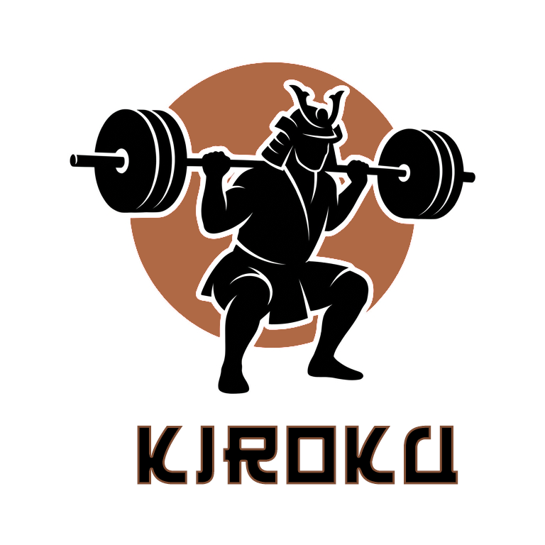
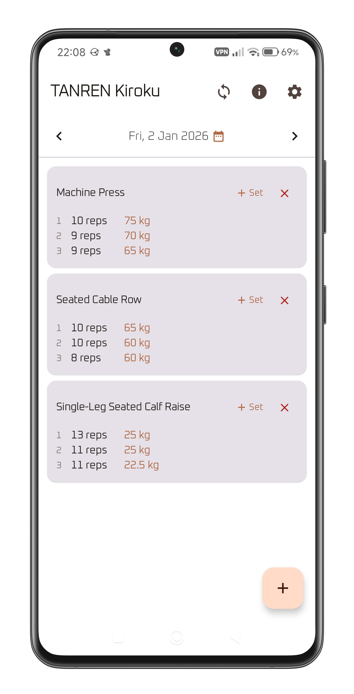
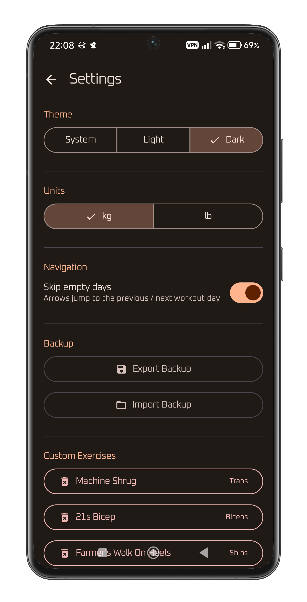
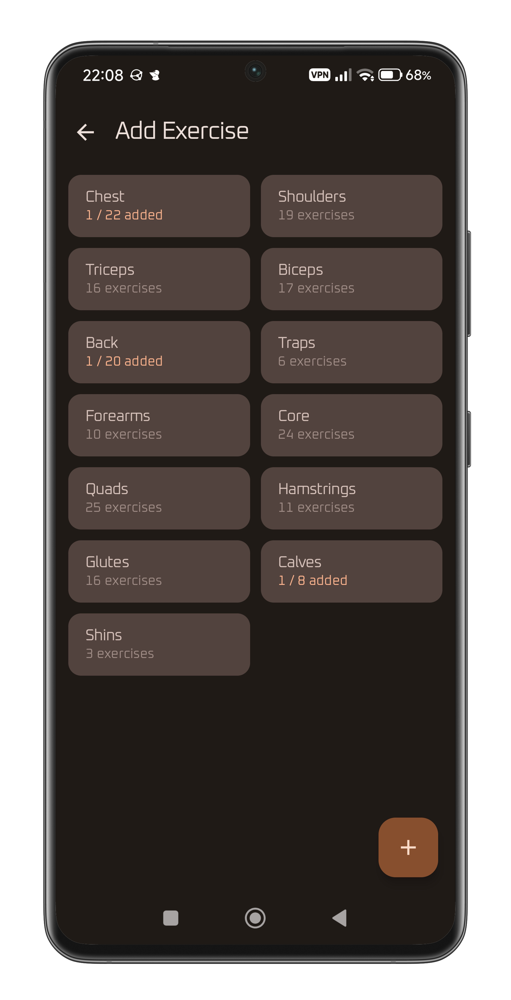
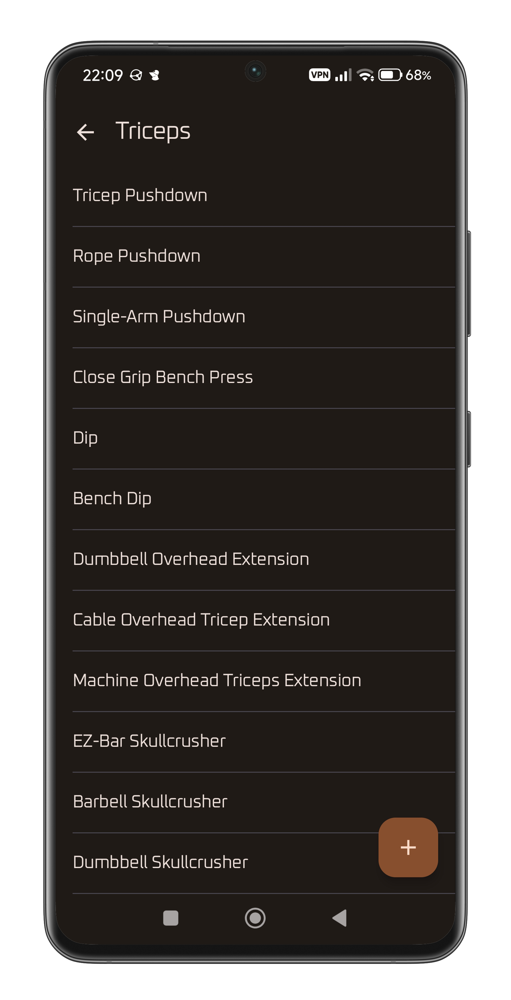
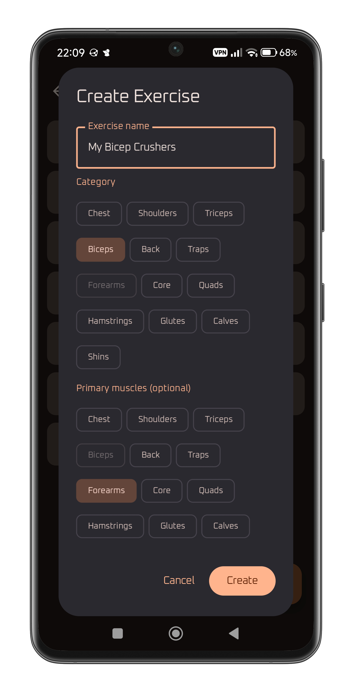
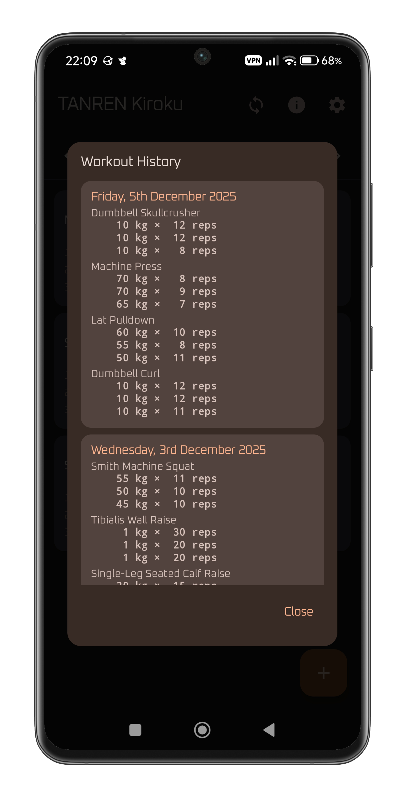
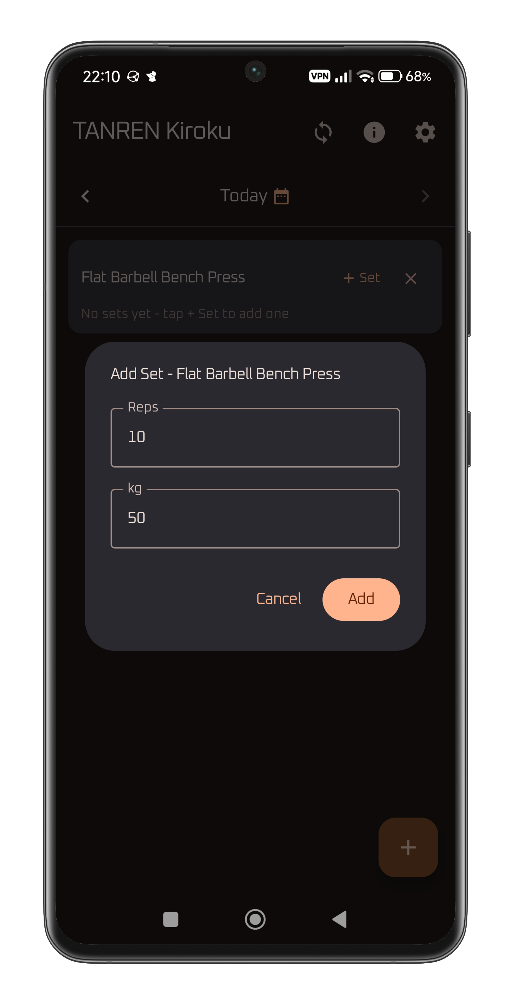
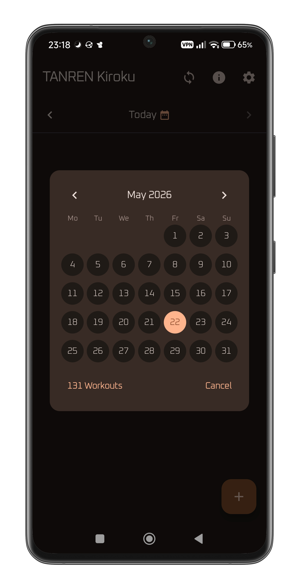
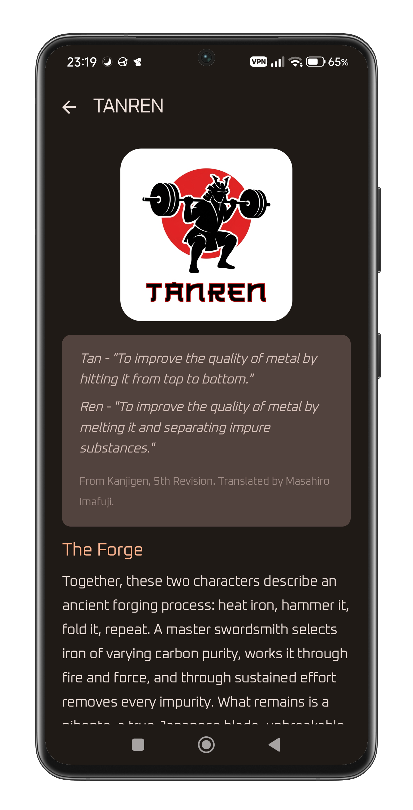

# TANREN Kiroku

**TANREN** (鍛錬) is a Japanese concept meaning the forging and tempering of metal, the repeated, deliberate process that turns raw material into something refined. Applied to training, it describes what happens when you show up consistently, lift with awareness, and build on what came before. Not motivation. Not inspiration. Work, recorded and repeated.

**Kiroku** (記録) means record, or documentation. This app is the record of your own reforging process.

---

## What it does

TANREN Kiroku is an Android workout logger. No accounts, no cloud, no subscriptions.

- **Log workouts by day:** Navigate through dates, add exercises, and track sets with reps and weight
- **Built-in exercise catalog:** Organized by muscle group, covering the major compound and isolation movements
- **Custom exercises:** Add any exercise not in the catalog, assign it to a muscle group
- **Unit support:** Switch between kg and lb at any time, weight will be converted automatically.
- **Date navigation:** move day by day, or enable "skip empty days" to jump only between days that have logged workouts
- **Copy workouts:** on any empty day, copy the full exercise list from a previous session as a starting point
- **Backup and restore:** export all workout data as a zip archive and restore it on any device
- **Sync with TANREN Metsuke:** transfer your workout files to the companion desktop app via QR code for visualization and analysis

## Screenshots

  
  
  
  

  
  
  

  
  
  

## Companion app

[TANREN Metsuke](https://github.com/kar-dim/TANREN-Metsuke) is the PC companion app, the eye (目付, *metsuke*) that reads what Kiroku has recorded. It provides charts, muscle group breakdowns, and progress tracking across your full history.

Sync is done locally over your network: scan the QR code shown by Metsuke and the transfer happens directly between your phone and desktop/laptop.

## Data

All data is stored locally on your device as plain files. No cloud, no account required. You own your data and can back it up, transfer it, or inspect it at any time.
